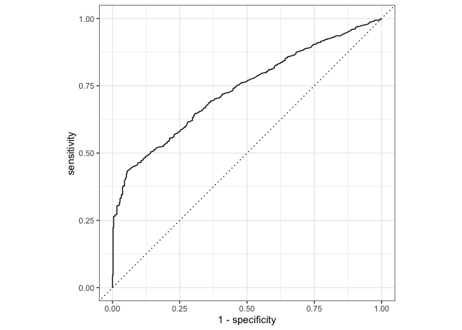
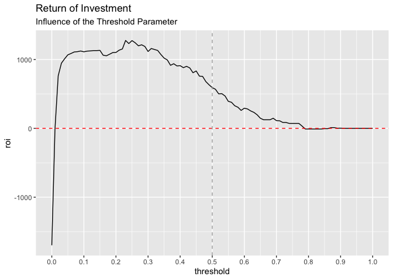
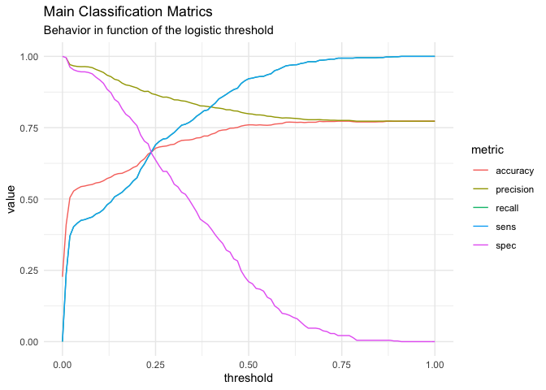

## Intro

Missed appointments cost the US healthcare system over $150 billion a year. Missed appointments directly cause loss of revenue and under-utilization of precious medical resources. It also leads to long patient waiting times and in the long run, leads to higher medical costs.

In this context lets build a predictive model to estimate if an patient will miss an appointment and use the prediction to take an action to try to avoid the cancellation.

## Dataset

We obtained a data set with 7,463 medical appointments over a three year period at a specialized care clinic. In this data set, each row corresponds to an appointment and indicates whether it was cancelled or not. 


```r
library(xlsx)
library(tidyverse)

# the life, the universe an everything else...
set.seed(42)

# data set
rawdata <- xlsx::read.xlsx("./data.xlsx", sheetIndex = 1)

# basic clean_up
appdata <- rawdata %>% 
  as_tibble() %>% 
  janitor::clean_names() %>% 
  mutate_if(is.character, as.factor)

dim(appdata)
```

```
## [1] 7463   12
```

### Data Overview

Lets see the overall aspect of the data set


```r
skimr::skim(appdata)
```


Table: Data summary

|                         |        |
|:------------------------|:-------|
|Name                     |appdata |
|Number of rows           |7463    |
|Number of columns        |12      |
|_______________________  |        |
|Column type frequency:   |        |
|factor                   |7       |
|numeric                  |5       |
|________________________ |        |
|Group variables          |None    |


**Variable type: factor**

|skim_variable  | n_missing| complete_rate|ordered | n_unique|top_counts                                 |
|:--------------|---------:|-------------:|:-------|--------:|:------------------------------------------|
|month          |         0|             1|FALSE   |       12|Aug: 815, May: 791, Jun: 721, Mar: 715     |
|weekday        |         0|             1|FALSE   |        5|Fri: 1733, Tue: 1715, Thu: 1640, Wed: 1448 |
|gender         |         0|             1|FALSE   |        2|F: 5176, M: 2287                           |
|marital_status |         0|             1|FALSE   |        4|MAR: 2504, SIN: 2434, OTH: 1505, DIV: 1020 |
|employment     |         0|             1|FALSE   |        4|UNE: 3824, RET: 1692, FUL: 1370, OTH: 577  |
|insurance      |         0|             1|FALSE   |        4|OTH: 2453, MED: 2366, HMO: 1982, PPO: 662  |
|status         |         0|             1|FALSE   |        2|Arr: 5801, Can: 1662                       |


**Variable type: numeric**

|skim_variable  | n_missing| complete_rate|        mean|          sd|      p0|      p25|      p50|      p75|     p100|hist  |
|:--------------|---------:|-------------:|-----------:|-----------:|-------:|--------:|--------:|--------:|--------:|:-----|
|date_id        |         0|             1|      525.13|      303.16|       1|      267|      505|      791|     1081|▇▇▇▆▆ |
|lag            |         0|             1|       27.24|       24.47|       0|       13|       20|       30|      126|▇▂▁▁▁ |
|mrn            |         0|             1| 34251294.01| 12244201.39| 7967755| 28165486| 41065688| 42621914| 44150534|▂▁▁▁▇ |
|age            |         0|             1|       54.09|       18.52|       6|       47|       57|       67|       90|▂▂▆▇▂ |
|time_since_reg |         0|             1|     4754.47|     2399.85|     179|     4374|     5686|     6196|     8421|▂▁▁▇▁ |

In total, 1662 out of 7463 appointments were cancelled, we can see it from column **status** (our target).

## Model

Since we are interested in appointment cancellations, the target variable is whether an appointment is cancelled or not and success in this particular context means that an appointment is cancelled.


```r
library(tidymodels)

# training & test data partition
appsplit <- initial_split(appdata)

# basic transformation
apprecp <- appsplit %>% 
  training() %>% 
  recipe(status ~ ., data=.) %>% 
  update_role(date_id, new_role = "id variable") %>% 
  update_role(status, new_role = "outcome") %>% 
  step_log(lag) %>% 
  step_dummy(all_nominal_predictors()) %>% 
  prep() 

# training & test set
app_tr <- juice(apprecp)
app_ts <- bake(apprecp, testing(appsplit))

# fit a model
app_model <- rand_forest(trees = 100, mode="classification") %>% 
  set_engine("ranger") %>% 
  fit(status ~ . - date_id, data=app_tr)
```

We build a simple and direct [random forest](https://en.wikipedia.org/wiki/Random_forest) model using [Ranger](https://www.rdocumentation.org/packages/ranger/versions/0.13.1/topics/ranger) implementation through [Tidymodels](https://www.tidymodels.org/) package. 


```r
app_model
```

```
## parsnip model object
## 
## Fit time:  464ms 
## Ranger result
## 
## Call:
##  ranger::ranger(x = maybe_data_frame(x), y = y, num.trees = ~100,      num.threads = 1, verbose = FALSE, seed = sample.int(10^5,          1), probability = TRUE) 
## 
## Type:                             Probability estimation 
## Number of trees:                  100 
## Sample size:                      5597 
## Number of independent variables:  30 
## Mtry:                             5 
## Target node size:                 10 
## Variable importance mode:         none 
## Splitrule:                        gini 
## OOB prediction error (Brier s.):  0.1617746
```

### Evalutaion

How good is our prediction model?


```r
# eval it
app_pred <- predict(app_model, app_ts) %>%  # class outcome
  bind_cols(predict(app_model, app_ts, type = "prob")) %>% # class prob
  bind_cols(select(app_ts,status)) %>%  # true value
  relocate(status, everything())

# performance
cm <- app_pred %>% 
  conf_mat(status, .pred_class)

cm %>% 
  summary() %>% 
  select(-.estimator) %>% 
  knitr::kable()
```


|.metric              | .estimate|
|:--------------------|---------:|
|accuracy             | 0.7599143|
|kap                  | 0.1613651|
|sens                 | 0.9216366|
|spec                 | 0.2099057|
|ppv                  | 0.7986779|
|npv                  | 0.4405941|
|mcc                  | 0.1774102|
|j_index              | 0.1315423|
|bal_accuracy         | 0.5657711|
|detection_prevalence | 0.8917471|
|precision            | 0.7986779|
|recall               | 0.9216366|
|f_meas               | 0.8557630|

```r
# AUC
app_pred %T>% 
  roc_auc(.pred_Arrived, truth=status) %>% 
  roc_curve(.pred_Arrived, truth=status) %>% 
  autoplot()
```

<!-- -->

## Taking a Business Decision to action

With the prediction in hands, we can make a business action to try revert appointments cancellations. Let's assume we can make a phone call to anyone predicted as "Cancelled" one or two days early and this will revert around 30% of the cancelled appointments. Is it a viable approach? Is it economically viable? At least, better than let the patient cancel his appointment?

To decide this we need to characterize the value of some variables, for this exercise we can assume:

* Cost of a phone call: $5
* Revert appointment cancellation rate: 30%
* Benefit of an appointment: $60

So, we can calculate the *Return of Investment* (_RoI_) of this action:


```r
# business variable
phone_cost   <- 5
reverse_rate <- .3
benefit      <- 60

# business case

# cost: phone to all patient predicted as "canceled"
total_cost  <- sum(cm$table["Cancelled",]) * phone_cost

# benefit: the reverse of 30% of patient that (in fact) would cancel the appointment
total_benefit <- cm$table["Cancelled","Cancelled"] * reverse_rate * benefit

# return of the investment
RoI <- total_benefit - total_cost
```

So we come out with this result:

* Total Cost: 202 * $5 = $1010
* Total Benefit: 89 * 0.3 * $60 = $1602
* Return: $1602 - $1010 = $592

As we saw, with a _RoI_ of $592 this action worth to be take.

One aspect essential to pay attention, we call to all patient predict as "cancellation" but we only get return over 30% (reversion rate) of those truly identified as "cancellation", a.k.a, **True Positives**. In other words, the cost of the action is function of **True Positives** plus **False Positives** and the benefit of the action is function only of **True Positives**. This is because a **False Positive** is a patient predicted as "cancellation" but he´ll go to the appointment, so the phone call has any benefit, only cost in those cases.

### Improving Business Performance 

Can we do better return without improving the model? As the _RoI_ is function of the rate between **True Positives** and **True Positives** + **False Positives** (a.k.a _Precision Metric_) in proportion of the benefits and cost we can _tune_ our classifier changing the [_logistic threshold_](https://deepchecks.com/glossary/classification-threshold/) to change the _precision_ towards to try maximize the _RoI_. 

To see this in practice, calculating what happens with our _RoI_ changing the classifier threshold from 0 to 1 in increments of 0.01:


```r
# generate the confusion metrics in function of an threshold
genConfMatrix <- function(.threshold, .evalData){
  # reply as a tibble row
  # new truth vs prediction table
  tibble(
      truth=.evalData$status, 
      # the prediction as function of the customized threshold
      estimate=unique(.evalData$status)[as.integer(.evalData$.pred_Cancelled>=.threshold)+1]
    ) %>%
    # gen the confusion matrix
    conf_mat(truth, estimate) %>% 
    return()
}

# calculates the RoI based in the result of a confusion matrix
calcRoi <- function(.cm, .benefit=60, .cost=5, .rev_rate=.3){
  tibble(
    TP = .cm$table["Cancelled","Cancelled"],
    FP = .cm$table["Cancelled","Arrived"] ) %>% 
    mutate(
      # cost: phone to all patient predicted as "canceled"
      cost    = (TP+FP) * .cost,
      # benefit: the reverse of 30% of patient that (in fact) would cancel the appointment
      benefit = TP * .rev_rate * .benefit,
      # return of the investment
      roi = benefit-cost
    ) %>% 
    return()
}

# using threshold from 0 to 1 in 0.01 increments
simulations <- tibble(threshold = seq(0,1,.01)) %>% 
  mutate( 
    # gen the confusion matrix and roi values for this threshold
    cm  = map(threshold, genConfMatrix, .evalData=app_pred),
    roi = map(cm, calcRoi)
  ) %>% 
  unnest(roi)

# what we get
simulations %>% 
  select(-cm) %>% 
  head(10) %>% 
  knitr::kable()
```


| threshold|  TP|   FP| cost| benefit|   roi|
|---------:|---:|----:|----:|-------:|-----:|
|      0.00| 424| 1442| 9330|    7632| -1698|
|      0.01| 422| 1098| 7600|    7596|    -4|
|      0.02| 408|  908| 6580|    7344|   764|
|      0.03| 404|  861| 6325|    7272|   947|
|      0.04| 402|  843| 6225|    7236|  1011|
|      0.05| 401|  829| 6150|    7218|  1068|
|      0.06| 401|  825| 6130|    7218|  1088|
|      0.07| 400|  818| 6090|    7200|  1110|
|      0.08| 398|  812| 6050|    7164|  1114|
|      0.09| 393|  797| 5950|    7074|  1124|

```r
# visualizing
simulations %>%           
  ggplot(aes(x=threshold, y=roi)) +
    # geom_point(size=2) +
    geom_line() +
    geom_hline(yintercept = 0, linetype="dashed", color="red") +
    geom_vline(xintercept = 0.5, linetype="dashed", color="darkgrey") +
    scale_x_continuous(breaks=seq(0,1,.1)) +
    labs(title="Return of Investment", subtitle = "Influence of the Threshold Parameter")
```

<!-- -->

We can see the the _RoI_ is better using a threshold between 0.2 and 0.3, and not 0.5 as usually set, more than that, at this level we get worst _accuracy_ for the model, take a look:


```r
simulations %>% 
  filter(threshold==.3) %>% 
  pull(cm) %>% 
  .[[1]] %>% 
  summary() %>% 
  select(-.estimator) %>% 
  knitr::kable()
```


|.metric              | .estimate|
|:--------------------|---------:|
|accuracy             | 0.6918542|
|kap                  | 0.2451063|
|sens                 | 0.7330097|
|spec                 | 0.5518868|
|ppv                  | 0.8476343|
|npv                  | 0.3780291|
|mcc                  | 0.2535561|
|j_index              | 0.2848965|
|bal_accuracy         | 0.6424483|
|detection_prevalence | 0.6682744|
|precision            | 0.8476343|
|recall               | 0.7330097|
|f_meas               | 0.7861659|
 


Compare this the _accuracy_ metric (0.6918542) with the value obtained in the first calculation above (0.7599143). 

## Conclusion and Classification Metrics

As we saw, a business decision is not only function of the accuracy of the model, costs and benefits can affect different aspects of the model. Remember to return to real life when applying the model in business case scenarios, to optimize the correct target.

And, be aware of the classification metrics.


```r
simulations %>% 
  mutate(
    metrics = map(cm, function(.x){
      .x %>% 
        summary() %>% 
        select(-.estimator) %>% 
        pivot_wider(names_from = .metric, values_from = .estimate) %>% 
        return()
    })) %>% 
  unnest(metrics) %>%
  select(threshold, accuracy, sens, spec, precision, recall) %>%
  pivot_longer(cols = -threshold, names_to = "metric", values_to = "value") %>% 
  ggplot(aes(x=threshold, y=value, color=metric))+
  geom_line() +
  labs(title="Main Classification Matrics", subtitle="Behavior in function of the logistic threshold") +
  theme_minimal()
```

<!-- -->
