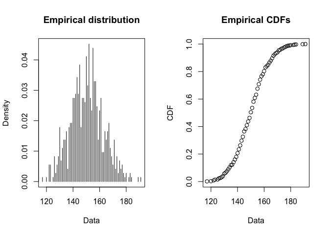
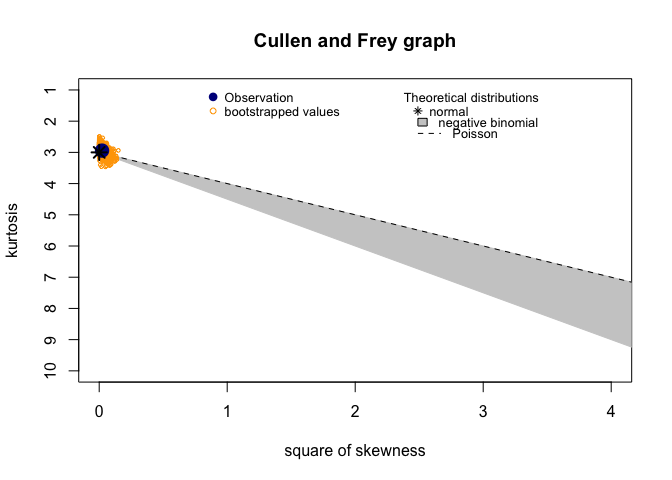
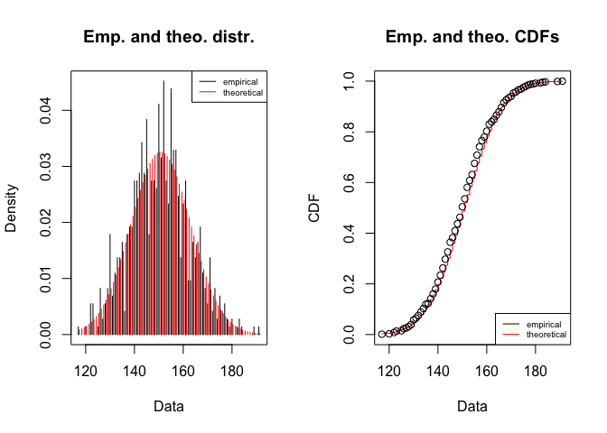
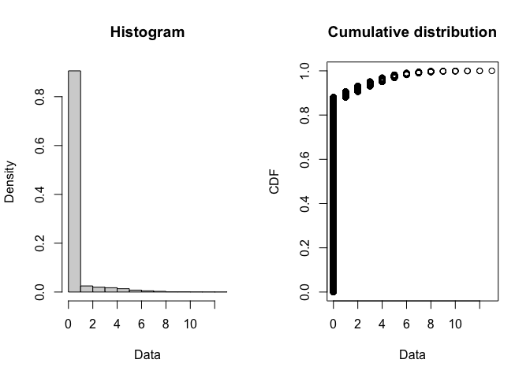

Nem todos os passageiros que compraram uma passagem de avião parecem no embarque, embora o ticket já tenha sido vendido os "no shows" fazem os voôs ocorrerem com capacidade ociosa, incorrendo num custo de oportunidade para a operadora bem como desperdícios de recursos. Uma estratégia para tentar ocupar a capacidade ociosa é fazer overbook, colocar à venda mais passagens do que o avião comporta, tentando assim compensar os "no shows" e ocupar os acentos vazios. O risco que se corre é no momento do embarque ter mais passageiros do que o avião comporta, levando a custos maiores para manejar os passageiros em outros voôs além do desgaste da marca e satisfação dos usuários. Neste post vamos analisar a distribuição da demanda e o comportamento dos "no shows" a fim de encontrar a melhor estratégia de overbooking a fim de maximizar o retorno e minimizar e simular usando monte carlo os impactos de remanejamento de passageiros em excesso.

## Abordagem

A abordagem que usaremos para tentar encontrar a melhor estratégia de overbooking seguirá os seguintes passos:

1. Entender o comportamento (distribuição) da demanda
1. Com base na distribuição da demanda, simular usando Monte Carlo 10 mil vôos
1. Definir o critério que gostaríamos de atender e então encontrar a melhor estratégia de overbooking

## Os Dados e a Demanda

Como ponto de partida vamos carregar os dados de demanda e comparecimento de um determinado voô comercial, disponível [nesta planilha de excel]() e fazer uma breve exploração dos dados e tentar entender o comportamento da demanda para que ela possa ser simulada.


```r
# setup ####
library(tidyverse)

# read data ####
raw_data <- readxl::read_xlsx("./Flight-Overbooking-Data.xlsx")

# simple clean up
flight_dt <- raw_data %>% 
  dplyr::select(1:5) %>% 
  janitor::clean_names()

# glimpse
flight_dt %>% 
  head(10) %>% 
  knitr::kable()
```


|date       | demand| booked| shows|      rate|
|:----------|------:|------:|-----:|---------:|
|2014-01-01 |    132|    132|   117| 0.8863636|
|2014-01-02 |    154|    150|   142| 0.9466667|
|2014-01-03 |    142|    142|   126| 0.8873239|
|2014-01-04 |    152|    150|   141| 0.9400000|
|2014-01-05 |    162|    150|   142| 0.9466667|
|2014-01-06 |    146|    146|   131| 0.8972603|
|2014-01-07 |    134|    134|   118| 0.8805970|
|2014-01-08 |    158|    150|   140| 0.9333333|
|2014-01-09 |    165|    150|   138| 0.9200000|
|2014-01-10 |    156|    150|   139| 0.9266667|

É um dataset bem direto e simples, com as colunas de demanda, quantos passageiros foram registrados, quantos apareceram e qual a taxa de presença (apareceram/registrados).  

### Data Overview


```r
# overview
flight_dt %>% 
  skimr::skim()
```


Table: Data summary

|                         |           |
|:------------------------|:----------|
|Name                     |Piped data |
|Number of rows           |730        |
|Number of columns        |5          |
|_______________________  |           |
|Column type frequency:   |           |
|numeric                  |4          |
|POSIXct                  |1          |
|________________________ |           |
|Group variables          |None       |


**Variable type: numeric**

|skim_variable | n_missing| complete_rate|   mean|    sd|     p0|   p25|    p50|    p75|   p100|hist  |
|:-------------|---------:|-------------:|------:|-----:|------:|-----:|------:|------:|------:|:-----|
|demand        |         0|             1| 150.40| 12.28| 117.00| 142.0| 150.00| 158.00| 191.00|▁▆▇▂▁ |
|booked        |         0|             1| 145.32|  6.85| 117.00| 142.0| 150.00| 150.00| 150.00|▁▁▁▂▇ |
|shows         |         0|             1| 133.73|  9.10| 106.00| 127.0| 138.00| 141.00| 147.00|▁▂▃▂▇ |
|rate          |         0|             1|   0.92|  0.03|   0.88|   0.9|   0.92|   0.94|   0.99|▇▃▇▃▁ |


**Variable type: POSIXct**

|skim_variable | n_missing| complete_rate|min        |max        |median              | n_unique|
|:-------------|---------:|-------------:|:----------|:----------|:-------------------|--------:|
|date          |         0|             1|2014-01-01 |2015-12-31 |2014-12-31 12:00:00 |      730|

Como vc pode ver, há um limite superior de 150 na coluna de registrados, indicando que essa é a capacidade do vôo, ou seja, 150 acentos.

### Demand Distribuition

Vamos tentar modelar a demanda, fazendo o fit da sua distribuição, para tal usaremos o pacote `{fitdistrplus}`


```r
library(fitdistrplus)

# checking the empirical distribution
plotdist(flight_dt$demand, discrete = T)
```

<!-- -->

```r
# what are the distribution candidates?
descdist(flight_dt$demand, boot=1000, discrete = T)
```

<!-- -->

```
## summary statistics
## ------
## min:  117   max:  191 
## median:  150 
## mean:  150.3973 
## estimated sd:  12.27513 
## estimated skewness:  0.149088 
## estimated kurtosis:  2.943392
```
O pacote `{fitdistrplus}` indicou três candidatos como melhor fit para a distribuição da demanda: [normal](https://pt.wikipedia.org/wiki/Distribui%C3%A7%C3%A3o_normal), [poisson](https://pt.wikipedia.org/wiki/Distribui%C3%A7%C3%A3o_de_Poisson) ou [negative binomial](https://pt.wikipedia.org/wiki/Distribui%C3%A7%C3%A3o_binomial_negativa). Vamos testar quais das duas mais comuns tem o melhor fit.

#### Normal


```r
# lets fit a normal and see what we get
fitdist(flight_dt$demand, "norm", discrete = T) %T>%
  plot() %>% 
  summary()
```

<!-- -->

```
## Fitting of the distribution ' norm ' by maximum likelihood 
## Parameters : 
##       estimate Std. Error
## mean 150.39726  0.4540115
## sd    12.26672  0.3210346
## Loglikelihood:  -2865.855   AIC:  5735.709   BIC:  5744.895 
## Correlation matrix:
##      mean sd
## mean    1  0
## sd      0  1
```

#### Poisson


```r
# lets fit a poisson and see what we get
fitdist(flight_dt$demand, "pois", discrete = T) %T>%
  plot() %>% 
  summary()
```

<!-- -->

```
## Fitting of the distribution ' pois ' by maximum likelihood 
## Parameters : 
##        estimate Std. Error
## lambda 150.3973  0.4538983
## Loglikelihood:  -2864.742   AIC:  5731.484   BIC:  5736.077
```

#### Best Fit

Observamos que a distribuição de Poisson tem, marginalmente, p melhor fit observando os indicadores [loglikehood](
Likelihood vs. Probability: What's the Difference? - Statologyhttps://www.statology.org › likelihood-vs-probability), [IAC](https://pt.wikipedia.org/wiki/Crit%C3%A9rio_de_informa%C3%A7%C3%A3o_de_Akaike) e [BIC](https://en.wikipedia.org/wiki/Bayesian_information_criterion). Vamos então usar poisson como nosso modelo de distribuição para a demanda.


```r
# Emp CDF fit for Poisson is a little better and IAC also is marginally better
demand.pois <- fitdist(flight_dt$demand, "pois", discrete = T)
```

### Show Up

O show up pode ser modelado como um sorteio binomial em cima do número de passageiros registrados para o vôo com uma taxa de sucesso determinado pela média histórica.


```r
mean(flight_dt$rate)
```

```
## [1] 0.9194333
```

Constatamos que a taxa média histórica de presença para o vôo é de 92%, podemos usar essa informação para simular o processo de presença fazendo:


```r
pass_reg <- 145 # number of passengers registered for the fligth
show_ups <- rbinom(1, pass_reg, mean(flight_dt$rate)) # one random binomial draw with size of pass_reg at historic show_up rate
show_ups 
```

```
## [1] 138
```


## Modeling and simulation

Vamos fazer um modelo para simular n vezes uma situação de voo, neste primeiro modelo vamos estabelecer um número fixo para o overbooking de 15 posições, isto é, 


```r
# demand simulation
simulateDemand <- function(overbook, n, capacity, showup_rate, demand_model) {
  # generate the demand scenarios (pois distributed)
  tibble(demand = rpois(n, demand_model$estimate)) %>% 
    # booked: demand inside capacity+overbook (flight seats) 
    mutate( booked = map_dbl(demand, ~min( .x, overbook+capacity ) )) %>% 
    # show-ups and no shows
    mutate( shows    = map_dbl(booked, ~rbinom(1,.x,showup_rate)),
            no_shows = booked - shows ) %>%
    # shop-up rate
    mutate( showup_rate = shows/booked ) %>%
    # calc overbook and empty seats
    mutate( overbooked  = shows - capacity,
            empty_seats = capacity - shows ) %>%
    # remove negative values
    mutate( overbooked  = map_dbl(overbooked, ~max(.x,0)),
            empty_seats = map_dbl(empty_seats, ~max(.x, 0))) %>% 
    return()  
}

# simulating 10 thousand cases using:
# fligth capacity: 150 passengers
# overbooking:      15 positions
# show_up rate:   ~92% historic based
# poisson distribuion: fitted previously
sim <- simulateDemand(15,10000,150,mean(flight_dt$rate),demand.pois)

# what we got
sim %>% 
  head(10) %>% 
  knitr::kable()
```


| demand| booked| shows| no_shows| showup_rate| overbooked| empty_seats|
|------:|------:|-----:|--------:|-----------:|----------:|-----------:|
|    137|    137|   124|       13|   0.9051095|          0|          26|
|    150|    150|   132|       18|   0.8800000|          0|          18|
|    141|    141|   134|        7|   0.9503546|          0|          16|
|    133|    133|   122|       11|   0.9172932|          0|          28|
|    159|    159|   149|       10|   0.9371069|          0|           1|
|    143|    143|   132|       11|   0.9230769|          0|          18|
|    150|    150|   135|       15|   0.9000000|          0|          15|
|    117|    117|   108|        9|   0.9230769|          0|          42|
|    163|    163|   152|       11|   0.9325153|          2|           0|
|    167|    165|   155|       10|   0.9393939|          5|           0|

Com as situações de embarque simuladas, podemos fazer a análise do comportamento do overbooking real (ou seja) quantos passageiros, acima da capacidade real do avião (150 acentos) de fato aparecerram no portão de embarque e que precisariam ser remanejados:


```r
# lets visualize the overbooked passengers distribution
sim %>% 
  count(overbooked)
```

<div data-pagedtable="false">
  <script data-pagedtable-source type="application/json">
{"columns":[{"label":["overbooked"],"name":[1],"type":["dbl"],"align":["right"]},{"label":["n"],"name":[2],"type":["int"],"align":["right"]}],"data":[{"1":"0","2":"8806"},{"1":"1","2":"253"},{"1":"2","2":"250"},{"1":"3","2":"199"},{"1":"4","2":"176"},{"1":"5","2":"136"},{"1":"6","2":"79"},{"1":"7","2":"51"},{"1":"8","2":"29"},{"1":"9","2":"7"},{"1":"10","2":"8"},{"1":"11","2":"3"},{"1":"12","2":"2"},{"1":"13","2":"1"}],"options":{"columns":{"min":{},"max":[10]},"rows":{"min":[10],"max":[10]},"pages":{}}}
  </script>
</div>

```r
plotdist(sim$overbooked)
```

<!-- -->


# chance to have 2 or less bumped pass
bumped_more_2 <- sim %>% 
  count(overbooked) %>% 
  filter(overbooked>2) %>% 
  summarise( total = sum(n) ) %>% 
  unlist()

1-(bumped_more_2/10000)

# simulation ####

# lets find the optimal overbook to get max of 2 bumped passengers in 95% of situations

# before that, lets create a auxiliary function
probBumpedPass <- function(simulation, nPass){
  # calc the probability of the number of bumped passengers be less then nPass in a simulation
  simulation %>% 
    count(overbooked) %>% 
    filter(overbooked<=nPass) %>% 
    summarise( total = sum(n)/10000 ) %>% 
    unlist() %>% 
    return()
}

# looking the behavior of the probability to get 2 (or 5) less passengers bumped
tibble(overbook=1:20) %>% 
  mutate( simulation = map(overbook, simulateDemand, n=10000, capacity=150, showup_rate=mean(flight_dt$rate))) %>% 
  mutate( prob2BumpPass = map_dbl(simulation, probBumpedPass, nPass=2),
          prob5BumpPass = map_dbl(simulation, probBumpedPass, nPass=5)) %>% 
  pivot_longer(cols=c(-overbook, -simulation), names_to = "bumped", values_to = "prob") %>% 
  ggplot(aes(x=overbook, y=prob, color=bumped)) +
  geom_hline(yintercept=0.95, linetype="dashed") + 
  geom_line() +
  geom_point() +
  theme_light()
  
# we can see that offering 13 additional seats (over plain capacity) we have less than 5% of chance to bumped more than 2 passengers
# Offering 18 additional seats (over plain capacity) we have less than 5% of chance to bump more than 5 passengers

# dependence ####

# we assume that the showup rate is fixed, is it?
cor.test(flight_dt$demand, flight_dt$rate)

# no it isn't, so we have to modeling this dependence

# lets make a simple linear model
rate_model <- lm(rate ~ demand, data = flight_dt)

# what we got?
summary(rate_model)
par(mfrow=c(2,2))
plot(rate_model)
par(mfrow=c(1,1))

# another simulation model considering the dependency between showup rate and demand
simulateDemandShowUpModel <- function(overbook, n, capacity, showup_model) {
  # generate a demand simulation
  demSim <- tibble(demand = rpois(n, demand.pois$estimate))
  # based in showup model calc a predicted showup_rate for each demand
  demSim$predShowup_rate = predict(showup_model, newdata=demSim)
  
  # complete the simulation
  demSim %>% 
    # booked: demand inside capacity (flight seats) 
    mutate( booked = map_dbl(demand, ~min( .x, overbook+capacity ) )) %>% 
    # compute the show-ups and no shows
    mutate( shows    = map2_dbl(booked, predShowup_rate, ~rbinom(1,.x,.y)),
            no_shows = booked - shows ) %>%
    # shop-up rate
    mutate( showup_rate = shows/booked ) %>%
    # calc overbook and empty seats
    mutate( overbooked  = shows - capacity,
            empty_seats = capacity - shows ) %>%
    # remove negative values
    mutate( overbooked  = map_dbl(overbooked, ~max(.x,0)),
            empty_seats = map_dbl(empty_seats, ~max(.x, 0))) %>% 
    return()  
}

# simulating one case ####
sim <- simulateDemandShowUpModel(15,10000,150,rate_model)

# what we got
sim

# lets visualize the overbooked passengers distribution
sim %>% 
  count(overbooked)

plotdist(sim$overbooked)

# chance to have 2 or less bumped pass
bumped_more_2 <- sim %>% 
  count(overbooked) %>% 
  filter(overbooked>2) %>% 
  summarise( total = sum(n) ) %>% 
  unlist()

1-(bumped_more_2/10000)

# we got a significatily different distribuition
# the bumped passengers are more flat


# looking the behavior of the probability to get 2 (or 5) less passengers bumped
# in the new model
tibble(overbook=1:20) %>% 
  mutate( simulation = map(overbook, simulateDemandShowUpModel, n=10000, capacity=150, showup_model= rate_model)) %>% 
  mutate( prob2BumpPass = map_dbl(simulation, probBumpedPass, nPass=2),
          prob5BumpPass = map_dbl(simulation, probBumpedPass, nPass=5)) %>% 
  pivot_longer(cols=c(-overbook, -simulation), names_to = "bumped", values_to = "prob") %>% 
  ggplot(aes(x=overbook, y=prob, color=bumped)) +
  geom_hline(yintercept=0.95, linetype="dashed") + 
  geom_line() +
  geom_point() +
  theme_light()

# now we got different results
# probability of 95% to get 2 or less bumped pass: 8 over capacity seats
# probability of 95% to get 5 or less bumped pass: 12 over capacity seats

# economic view ####
ticket_prc <- 314
transf_fee <- 60
bumped_cost <- 400

demand_sim <- simulateDemandShowUpModel(15, n=10000, capacity=150, showup_model= rate_model)

finance_sim <- demand_sim %>% 
  mutate(
    revenue       = booked * ticket_prc,
    noshow_cost   = no_shows * transf_fee,
    overbook_cost = overbooked * bumped_cost,
    profit        = revenue - (noshow_cost+overbook_cost)
  )

plotdist(finance_sim$profit)

calcFinanceResults <- function(simulation, ticket_prc=314, transf_fee=60, bumped_cost=400){
  simulation %>% 
    mutate(
      revenue       = booked * ticket_prc,
      noshow_cost   = no_shows * transf_fee,
      overbook_cost = overbooked * bumped_cost,
      profit        = revenue - (noshow_cost+overbook_cost)
    ) %>% 
    return()
}

sim_Finance <- tibble(overbook=1:20) %>% 
  mutate( simulation = map(overbook, simulateDemandShowUpModel, n=10000, capacity=150, showup_model= rate_model)) %>% 
  mutate( simulation = map(simulation, calcFinanceResults)) %>% 
  unnest(simulation)

sim_Finance %>% 
  dplyr::select(overbook, overbooked, revenue:profit) %>% 
  ggplot(aes(x=overbook, y=profit, group=overbook)) + 
  geom_violin()

sim_Finance %>% 
  dplyr::select(overbook, revenue:profit) %>%  
  mutate( total_cost = noshow_cost+overbook_cost ) %>% 
  group_by(overbook) %>% 
  nest() %>% 
  mutate( cost = map(data, function(.dt){
    return(enframe(quantile(.dt$total_cost, c(0.05,0.95), na.rm=T)))
  }) ) %>% 
  unnest(cost) %>% 
  ungroup() %>% 
  ggplot(aes(x=overbook, y=value, color=name)) +
  geom_line() +
  geom_point() +
  theme_light()


sim_Finance %>% 
  dplyr::select(overbook, revenue:profit) %>%  
  group_by(overbook) %>% 
  nest() %>% 
  mutate( cost = map(data, function(.dt){
    return(enframe(quantile(.dt$profit, c(0.05,0.95), na.rm=T)))
  }) ) %>% 
  unnest(cost) %>% 
  ungroup() %>% 
  ggplot(aes(x=overbook, y=value, color=name)) +
  geom_line() +
  geom_point() +
  theme_light()


sim_Finance %>% 
  dplyr::select(overbook, revenue:profit) %>%  
  mutate( total_cost = noshow_cost+overbook_cost ) %>% 
  group_by(overbook) %>% 
  nest() %>% 
  mutate( cost = map(data, function(.dt){
    .dt$total_cost %>% 
      quantile(c(0.05,0.95), na.rm=T) %>% 
      enframe() %>% 
      mutate(type="cost") %>% 
      return()
  }) ) %>% 
  mutate( profit = map(data, function(.dt){
    .dt$profit %>% 
      quantile(c(0.05,0.95), na.rm=T) %>% 
      enframe() %>% 
      mutate(type="profit") %>% 
      return()
  }) ) %>% 
  mutate( finance = map2(cost, profit, bind_rows)) %>% 
  unnest(finance) %>% 
  mutate( name=str_c(type, name, sep = "_") ) %>% 
  ggplot(aes(x=overbook, y=value, color=name)) +
  geom_line() +
  geom_point() +
  theme_light()


## Análise Temporal

Este exercício não fez uma análise temporal, estratégias de overbooking podem ser customizadas para atender melhor a variação sazional da demanda melhorando os resultados obtidos, este exercício ficará para uma próxima ocasião.
